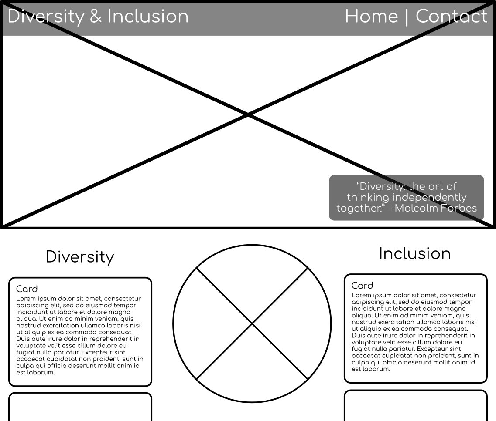

# Diversity and Inclusivity

## Overview

### Purpose
The purpose of this project is to create a easy to use mobile-first website to inform the users of the definition and importance of Diversity and Inclusivity, and some of the legal requirements of them by the government.

### Target Audience
The target audience consists of two groups of users. People looking for information to educate themselves on basic facts about diversity and inclusion, and people looking for more in-depth information.

## User Stories

### Must-Have User Stories
- **User Story 1:**  As a business executive, I would like a list of tips of how to implement diversity and inclusivity in my company.
  **Acceptance Criteria:** List of tips of how to implement diversity and inclusivity in your company.
- **User Story 2:** As a student, I would like to find the definitions of inclusivity and diversity for my homework.
  **Acceptance Criteria:** A clear set of definitions of diversity and inclusivity.
- **User Story 3:** As a contributor, I want to be able to submit a suggestion to the web-page to improve the information on it.
  **Acceptance Criteria:** Form for submitting feature requests.
- **User Story 4:** As a business executive, I want to know why diversity and inclusion are important for my business.
  **Acceptance Criteria:** Clearly stated information about the importance of diversity and inclusion.

### Should-Have User Stories
- **User Story:** As a Business Executive, I need information about what the legal requirements for diversity and inclusion are within my company.
  **Acceptance Criteria:** Links to official government guidance for legal requirements.
- **User Story:** As a contributor to the page, I want to have a quick way to find our social media links to share any updates we make.
  **Acceptance Criteria:** Section for social media links in footer.

### Could-Have User Stories
- **User Story:** A user is red-green colour-blind, so I want the site to use high contrast colours to make it easier to navigate.
  **Acceptance Criteria:** High Contrast Colour Scheme that is readable when checked against a colour-blindness test

## Design Decisions

### Wireframes

### Design Considerations
- I chose a nice comfortable layout to my eyes that gives plenty of space.
- I chose an autumnal colour scheme as it is the most relaxing time of the year in my opinion.
- I chose comfortaa for my font as it is a google font that has a pleasing appearance while still being clear and readable.

### Accessibility Considerations
- I only have one image on the site, which is the page background, so I don't really need an aria text for it as it is not part of the content.
- I ensured that the buttons have aria attributes on them for ease of use with screen readers.
- I have tried to use a high-contrast colour scheme to make navigating the web-page easier.

## Features Implementation

### Core Features (Must-Haves)
1. List of tips of how to implement diversity and inclusivity in your company.
 - Implemented as a carousel in each of the sections.

2. A clear set of definitions of diversity and inclusivity.
 - Implemented as the first card in each of the two sections.

3. Form for submitting feature requests.
 - Implemented as a modal that pops up when you click on the "contact" button in the nav bar.

4. Clearly stated information about the importance of diversity and inclusion.
 - Implemented as a card in each of the sections on the main page.

### Advanced Features (Should-Haves)
- **Feature 1:** Links to official government guidance for legal requirements.
- **Feature 2:** Section for social media links in footer.

### Optional Features (Could-Haves)
- **Feature 1:** A user is red-green colour-blind, so I want the site to use high contrast colours to make it easier to navigate.

## AI Tools Usage

### ChatGPT
I used ChatGPT to assist me when I needed help remembering which input field to use. I asked it what to use for a multi-line text input field and it told me to use a textarea tag, which I then impelemnted. That is all.

## Testing and Validation

### Testing Results
Testing on different screen sizes showed that the website is responsive to devices. The buttons work as they should and send the user to the correct places.

1. I used chrome developer tools extensively over the course of the project to help identify issues and fix them.

2. I found an issue caused by the carousel where the size of the element changes causing elements to be pushed around.
 - I fixed it by simply setting the carousel to a minimum of 330px high.

### Validation
I validated the website using the W3C validator for both HTML and CSS
1. When validating the HTML I found that the script tags were "stray", this was fixed by moving them inside of the body.
2. One of my aria controls was not pointing to the correct thing. I fixed it.

## Deployment

### Deployment Process
I deployed the project using github pages. I went to the repo settings and to the pages section, then deployed the main branch. I did not have any issues during the deployment process. [Website is deployed here](https://jamesvanstone.github.io/Project-1---Diversity-and-Inclusion/)

## Reflection on Development Process
The process of making this website was quite fun, though finding the right content to put in the sections was something I found challenging. I also found bootstrap awkward to work with and did not enjoy that part of the process. I will be looking for another framework to use in the future, as bootstrap has too many default styles that I had to over-write to produce the layout I wanted.

### Successes
1. Responsiveness was good, I enjoyed setting up the different layouts for different screen sizes.
2. I enjoyed using some of the bootstrap templates for things such as the carousel and the modal. They were quick to implement and satisfying when in.

### Challenges
1. I was ill on day two which meant that I had to do a lot of work outside of work hours to catch up. Day two was very rough and I was feeling quite down because of it.
2. There were some issues caused by excess margins and padding that I spend several hours trying to fix, which was very frustrating.

### Final Thoughts
Overall I am quite satisfied with the project, though I didn't get quite as much done as I wanted due to loosing most of day 2 to tireness and feeling unwell.

## Code Attribution
[Bootstrap 4.6](https://getbootstrap.com/docs/4.6/getting-started/introduction/)
[Fontawesome for Icons](https://fontawesome.com/)

## Future Improvements
Switching things up to be better laid out on two or three pages would be nice. Also, adding more images to make the page more visually interesting would be a good thing to add in the future.